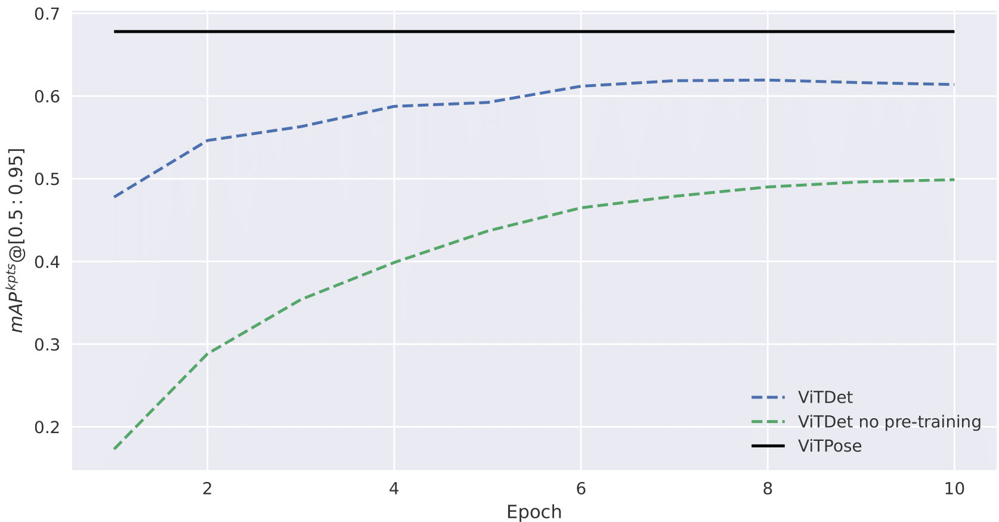

## Deep Learning Project - MVA 2022-2023

This project is about verifying if using a plain Vision Transformer (ViT) as a backbone for human pose estimation
can be a good alternative to the current state-of-the-art models.
For that, I extended a object-detection model, ViTDet, that uses a vanilla ViT as a backbone within a Mask R-CNN
framework (originally made for CNN backbones). 

In this project, I used the COCO keypoints dataset to fine-tune and test ViTDet on a human pose estimation task.
I compared the obtained results with the ones of a very efficient baseline model, ViTPose.

As we can see in the following table and figure, ViTDet obtains good results and may outperform ViTPose
with a better training procedure. Using pre-trained weights of ViTDet trained on the COCO dataset allowed me to
obtain a better performance than training from scratch.

| model | backbone | mAP box | mAP keypoints |
|   --- |      --- |     --- |           --- |
| ViTDet (no pre-training) | ViT-B/16 | 0.435 | 0.499 |
| ViTDet | ViT-B/16 | 0.562 | 0.614 |
| ViTPose | ViT-B/16 | . | 0.678 |




### Usage
Download the COCO dataset and put it in a `coco` folder at the root of the repository.

```bash
pip install -r requirements.txt
git clone https://github.com/open-mmlab/mmcv.git
cd mmcv
git checkout v1.3.9
MMCV_WITH_OPS=1 pip install -e .
cd ..
git clone https://github.com/ViTAE-Transformer/ViTPose.git
cd ViTPose
pip install -v -e .
cd ../
sh script_train.sh # to train ViTDet
sh script_test.sh # to test ViTDet & ViTPose
```
